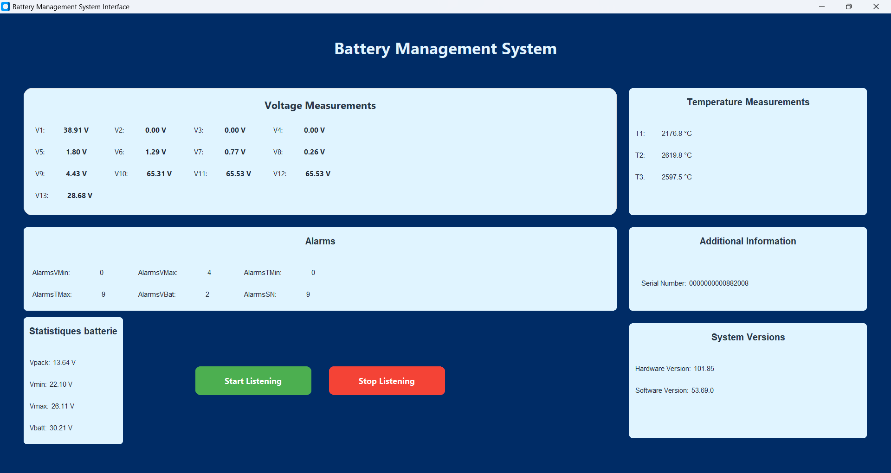

# PCAN BMS GUI
 
This README file provides instructions on how to run BMS PCAN GUI.
 
**Prerequisites:**
 
* **Python:** You need to have Python installed on your system. You can download and install Python from the official website: https://www.python.org/downloads/
* **python-can:** This library is required for interacting with CAN bus devices.
    * **Installation:** Open your terminal or command prompt and run:
        ```bash
        pip install python-can
        ```
* **customtkinter:** This library is used for creating the graphical user interface (GUI).
    * **Installation:** Open your terminal or command prompt and run:
        ```bash
        pip install customtkinter
        ```
 
**Running the Program:**
 
1. **Navigate to the program directory:** Open your terminal or command prompt and use the `cd` command to navigate to the directory where the Python script is located.
2. **Run the script:** Execute the following command in the terminal:
    ```bash
    python GUI_PCAN.py
    ```
 
**Troubleshooting:**
 
* If you encounter any issues with the installation or running of the program, please check the following:
    * **Python version:** Ensure that you have the correct Python version installed (Python 3 is recommended).
    * **Library versions:** Make sure that the `python-can` and `customtkinter` libraries are installed correctly and compatible with your Python version.
    * **Dependencies:** Check if there are any other dependencies required by the program and install them accordingly.
    * **Script errors:** Carefully review the Python script for any syntax errors or logical issues.
 
**Note:**
 
* This README file provides general instructions. The specific steps and commands may vary depending on your operating system and Python environment.
* If you encounter any problems, please refer to the documentation of the `python-can` and `customtkinter` libraries for more detailed information.
 

 